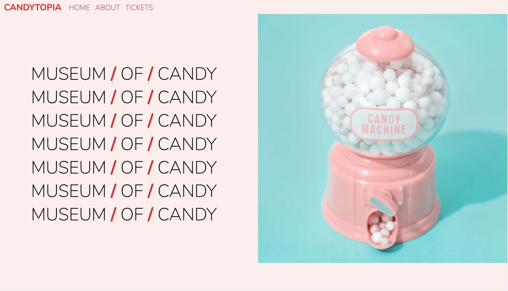

# [Candytopia](https://candytopia.netlify.com/)

🍭 Fictional website for a Candy Museum built using Bootstrap 4.

[Deployed front-end](https://candytopia.netlify.com/)

## Tech Stack

- Bootstrap
- HTML5
- CSS3

## Installation

1. `git clone https://github.com/dorabelme/Candytopia.git`
2. Open `index.html` to access the site.
